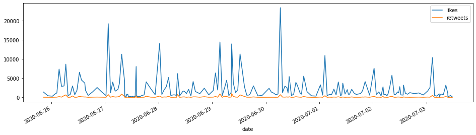
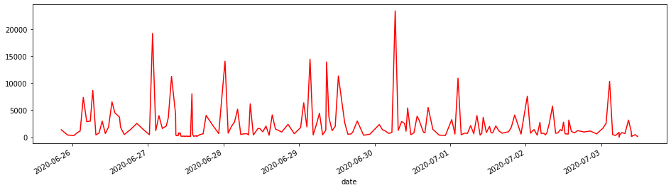

# Visualizing_Tweet_Data
Some basic analysis of the data we have stored into the pandas data frame. Specifically, we will be plotting time series plots based on the number of "likes" and "retweets" from a specified Twitter user. 

Here are some graphs for visualizing the twitter data :

